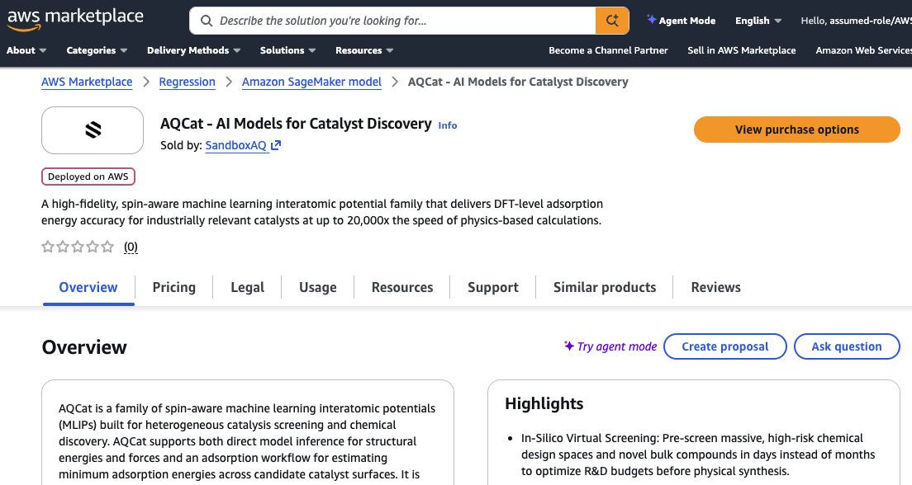
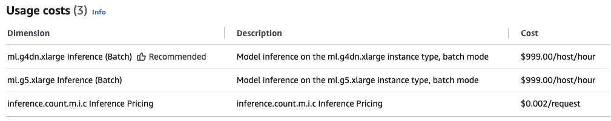
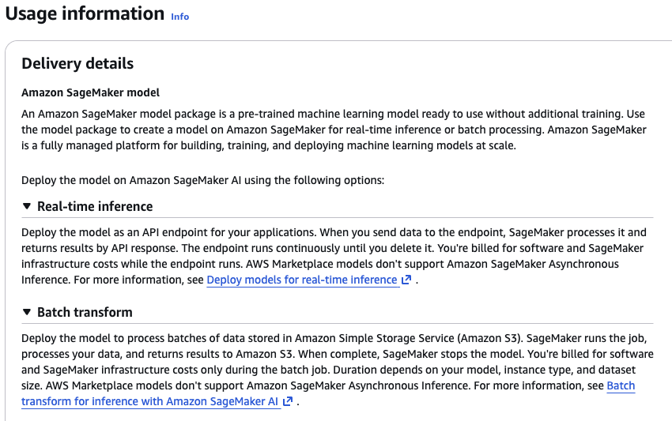
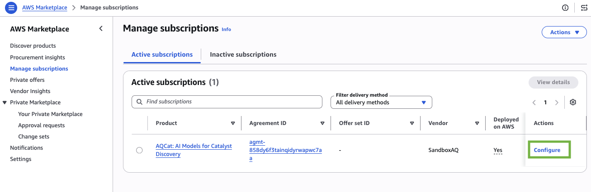
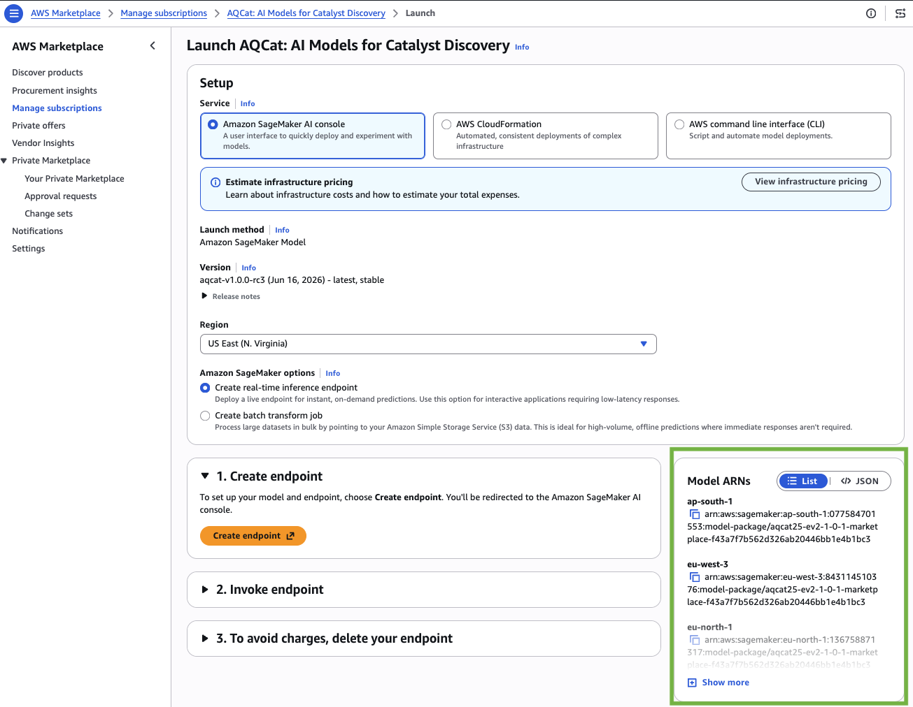
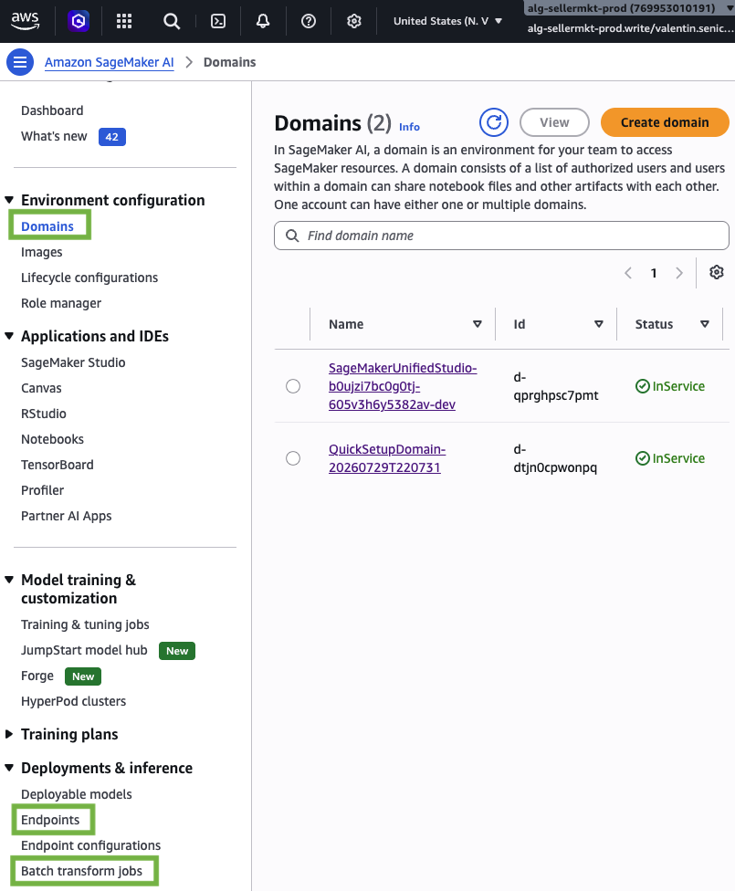
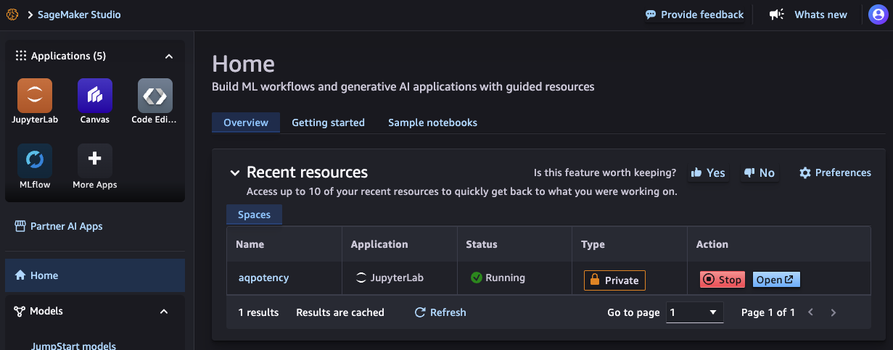
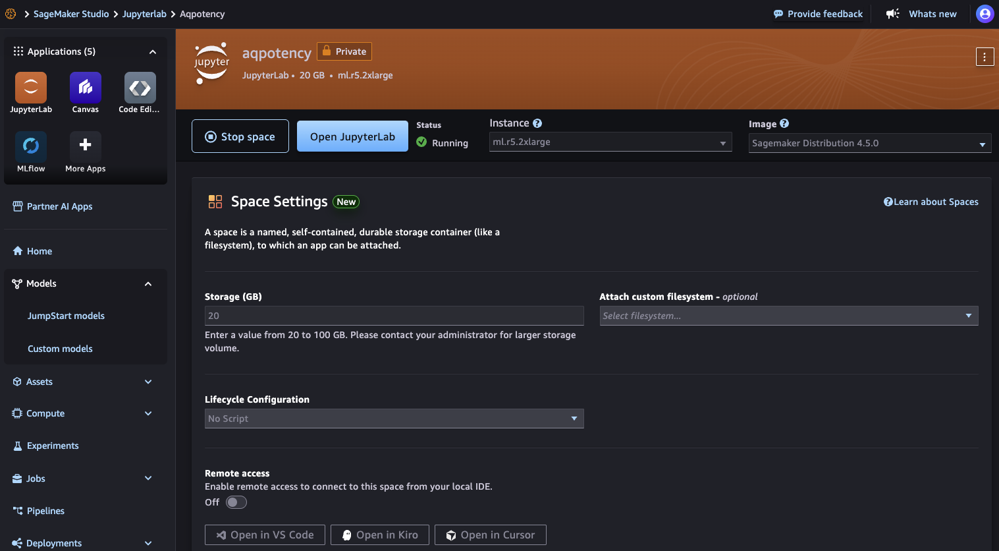
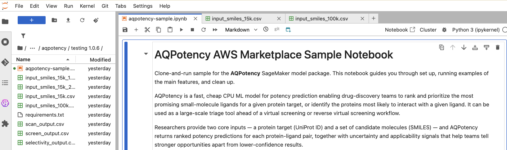

>[!IMPORTANT]
> This guide is designed as an introduction to AWS SageMaker, to complement our model-specific python notebooks (`*-sample.ipynb` files in this repo) demonstrating the concrete user experience and features for each product.

<br>

# Onboarding guide to our AWS SageMaker products

This guide covers the first steps of the user journey to launch our models on AWS SageMaker. We guide a user with an AWS account to
- find, subscribe and **launch our products** through AWS Marketplace
- help them understand the **value and pricing** driving AWS SageMaker, and 
- **set up an environment** allowing them to run their first examples in AWS SageMaker.


>[!NOTE]
> The official AWS documentation remains their most accurate and up-to-date source of information. We refer to it as much as possible. This guide attempts to simplify the experience and take you through the shortest path to use the products.

## Pre-requisites

- An AWS account. If you are part of an organization, you likely need to reach out to either your manager or your IT helpdesk to request access to the AWS platform. You can provide them with a link to this guide to help them understand the AWS IAM role / permissions you need.
- AWS CLI is not strictly required for onboarding and running your first examples included in our model-specific notebooks using the readily-available SageMaker Studio web UI.

<br>

## 0. What is even AWS SageMaker ?

[AWS SageMaker](https://aws.amazon.com/sagemaker/) (now renamed AWS SageMaker AI) can be thought, in the context of our products, as a fully managed service allowing you to deploy secure, private containers in AWS loaded with our ML products (called "endpoint") and interact with them in real time or through large asynchronous jobs from a "host" machine (ex: your laptop or another machine in the cloud you're logged in). 

Your IP is protected as only you can interact with this container and we do not collect any metadata. Conversely, you cannot peek at the code running on that container: you can only make requests through an API we provide and receive results.

In a nutshell:
- You subscribe to a product on AWS Marketplace. It gives you a compute region-specific arn string referencing it.
- You either open a notebook / script through the SageMaker UI or your local machine (requires the AWS CLI)
- You reference the arn of the SageMaker product and open a session with AWS `boto3`: you are now ready to launch endpoints and make requests (see any of our sample jupyter notebooks for concrete examples with Python).

>[!NOTE]
> Those products are not limited to simply running inference with a ML model, our interface may expose features running non-ML workflows. 

<br>

## 1. AWS MarketPlace: find and understand the product listing

Your first step is to go to the [AWS MarketPlace](https://aws.amazon.com/marketplace/), where various products are available.
Use the search bar to search for the desired product (ex: AQCat) or even "SandboxAQ" directly to find our seller page with all products underneath.

Click the product of your choice to explore the detailed product page, which contains a lot of information about description, highlights, link to documentation ... and more importantly **pricing and usage** sections. We'll help you make sense of this information in the next section, as it shapes your perception of the cost and value of the product.



### Understanding pricing and the value you get from our AWS SageMaker products

>[!IMPORTANT]
> AWS supports private offers, which allows SandboxAQ to offer custom pricing to customers. If you wish to reach out to SandboxAQ as an individual or organization to discuss a potential agreement, please reach out to support.aisim@sandboxaq.com.

Let's start with an example of what you may see on the AWS Marketplace listing, when scrolling down to the **Pricing** and **Usage** section.

We'll help you understand infrastructure charges, as well how software charges - sometimes by inference, sometimes by machine-hour - tie to 2 different experiences: **real-time inference** or **batch transform asynchronous job**.






<br>

When using an AWS SageMaker product, you pay for:

- **infrastructure cost**, to AWS. That's basically paying them for the machines you'll be using to run the models on AWS SageMaker. You can find the rates here: https://aws.amazon.com/sagemaker/ai/pricing/.
- **software cost**, to SandboxAQ. That's the price we charge you for using our software. This is what you see in the pricing section of the listing. It can be confusing, and warrants an explanation.

AWS SageMaker provide two modes called **real-time inference** and **batch transform**. They provide different user experiences delivering the same numerical results, but with a different pricing. We provide below a summary, but you can consult the official AWS documentation ([ML product pricing](https://docs.aws.amazon.com/marketplace/latest/userguide/machine-learning-pricing.html#ml-pricing-inference), [Real-time](https://docs.aws.amazon.com/sagemaker/latest/dg/realtime-endpoints.html), [Batch transform](https://docs.aws.amazon.com/sagemaker/latest/dg/batch-transform.html), ...) to get more exhaustive information from the source.

<br>

| | Real-time inference | Batch transform jobs |
| --- | --- | --- |
| Software Pricing | Fixed cost per inference. Predictable. | Machine-hour price, calibrated on machine throughput. |
| Purpose | Intended usage is for “online” near real-time predictions, with a user actively interacting with a persistent endpoint. | Asynchronous “offline” inference on large datasets, or jobs too long / big for real-time.
| Endpoint management | User needs to create an endpoint to run calculations and turn it off themselves to stop infrastructure charges. | Machines are launched and turned off automatically by AWS. |
| Duration | Requests complete within 60 seconds. Can write loops to execute consecutive requests automatically. | Asynchronous jobs for large use cases, instances can run for days. Easily parallelize over more machines to reduce duration. |
| Input / output format | Input and output data sent as JSON payloads (max size 6 MB). | Read and write files to AWS S3 storage, processes it by chunks of 100MB distributed across instances at runtime automatically. |
| Monitoring | Active user expecting responses and results within seconds. | No "babysitting" needed. Job status can be monitored in Web UI or notebook / CLI. Survives python notebook disconnect. |

<br>
<br>

Because each product is different, they expose a different set of real-time VS batch transform features. Check out the dedicated sample notebooks (`*-sample.ipynb`) for each of our AWS SageMaker products to get a feel for the value you're getting for those prices. Our notebook examples are designed to incur limited charges if you run them as-is, yet providing code reusable as-is to tackle routine and larger use cases.

<br>

## 2. AWS MarketPlace: subscribe and launch

On the top right of the listing, you'll find a button to subscribe to the product. It takes you to a page that summarizes information from the listing, and AWS terms and conditions. Once reviewed, click "subscribe" at the bottom of the page. AWS may take 1-2 minutes to complete the action.

The product is now added to your active AWS Marketplace subscriptions. A link is now available to see your active subscriptions (the http address depends on your region, such as https://us-east-1.console.aws.amazon.com/marketplace/subscriptions?region=us-east-1). This link shouldn't change unless you change region, you can bookmark it for convenience.

In order to use a given product, you need to retrieve the arn. This arn is region-specific (e.g different compute regions have different arns) and version-specific - this means that if you want to use the latest version of the product, you should use the latest arn. You can grab the arn for your region following the screenshots below.

>[!TIP]
> You do not need to use this web UI at this moment to create endpoints, models and configurations. We demonstrate how to do it through our sample notebooks or the SageMaker UI in the next section.





With that, you and your coworkers are now ready to use AWS SageMaker.

<br>

### 3. Running your first examples in SageMaker UI

The most straightforward way to use AWS SageMaker products is through their web UI and the SageMaker Studio.
You can also set up and use the AWS CLI to perform these actions from another environment.

- It allows you to basically spin up Jupyterlab environments running on a machine hosted in AWS, from which you can start, stop or query endpoints. This "domain" workspace can be shared with your collaborators.
- Through the left-side menu, you can easily manage endpoints and other artifacts created in SageMaker, as well as the JupyterLab domains your team use. You can also monitor and inspect asynchronous jobs. 

Through the UI or using this address - with your actual region prefix - (https://us-east-1.console.aws.amazon.com/sagemaker/home?region=us-east-1#/dashboard) you can get to the SageMaker dashboard and find the side menu. This side menu in particular exposes `Domains`, `Endpoints` and `Batch transform Jobs`, and is very convenient for managing and monitoring your resources.

<br>



<br>

If you click `Domains`, you should see a page similar to the screenshot above. The orange button offers you several options ("quick setup domain" is the simplest, quickest way to get started). The blue button `Open Studio` is available if you wish to use an existing one.

When creating a domain in studio, you are asked to select a machine type. This is your **host machine** running the notebook, which sends requests to the endpoint. If your intent is simply to run the sample notebooks then you can go with the simplest default machine: it is cheap and does the trick. The screenshots below describe the experience:





<br>

AWS will charge you infrastructure cost as long as your space is active, use this page to `stop` and `restart` it as needed to reduce expenses. If you select `Open JupyterLab` then you get the Jupyter lab environment you may be familiar with, loaded with a SageMaker image and some useful python packages. Your changes, checkpoints and files are all stored on AWS and are persistent (e.g they are still there after you close and restart the Jupyterlab).

You are now ready to try our sample Jupyter notebooks and data, which you can conveniently airdrop into your Jupyter environment with the following command, or drag and drop in the UI.

```
git clone https://github.com/sandbox-quantum/marketplace-public-docs.git
```



<br>

